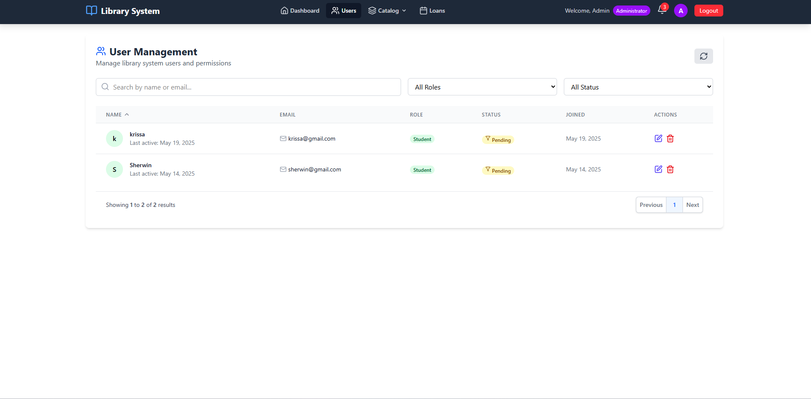

# LMS Library Management System

A modern, responsive library management system built with React and Vite. This application provides an intuitive interface for managing books, students, and borrowing records with real-time updates and a seamless user experience.

## 🚀 Built With

- **React 18** - Modern React with hooks and concurrent features
- **Vite** - Lightning-fast build tool and development server
- **JavaScript/ES6+** - Modern JavaScript features
- **CSS3** - Responsive design with modern styling
- **ESLint** - Code quality and consistency

## ⚡ Vite Features

This template provides a minimal setup to get React working in Vite with HMR (Hot Module Replacement) and ESLint rules.

Currently, two official plugins are available:

- [@vitejs/plugin-react](https://github.com/vitejs/vite-plugin-react/blob/main/packages/plugin-react) uses [Babel](https://babeljs.io/) for Fast Refresh
- [@vitejs/plugin-react-swc](https://github.com/vitejs/vite-plugin-react/blob/main/packages/plugin-react-swc) uses [SWC](https://swc.rs/) for Fast Refresh

## 🌟 Features

### Core Functionality

- **Book Management**: Add, edit, delete, and search books with detailed information
- **Student Management**: Comprehensive student records with borrowing history
- **Borrowing System**: Real-time tracking of book loans and returns
- **Dashboard Analytics**: Interactive charts and statistics
- **Responsive Design**: Mobile-first approach for all devices
- **Fast Performance**: Optimized with Vite's build system

### Technical Features

- Hot Module Replacement (HMR) for instant development feedback
- Component-based architecture
- State management with React hooks
- Modern ES6+ JavaScript
- Code splitting and lazy loading
- Progressive Web App capabilities

## 🛠️ Prerequisites

- Node.js 16.0 or higher
- npm 7.0 or higher (or yarn/pnpm)
- Modern web browser

## 🚀 Quick Start

### Installation

1. **Clone the repository**

   ```bash
   git clone https://github.com/surewing15/lms.git
   cd lms
   ```

2. **Install dependencies**

   ```bash
   npm install
   # or
   yarn install
   # or
   pnpm install
   ```

3. **Start development server**

   ```bash
   npm run dev
   # or
   yarn dev
   # or
   pnpm dev
   ```

4. **Open your browser**
   - Navigate to `http://localhost:5173`
   - The app will automatically reload when you make changes

### Build for Production

```bash
npm run build
# or
yarn build
# or
pnpm build
```

### Preview Production Build

```bash
npm run preview
# or
yarn preview
# or
pnpm preview
```

## 📱 Screenshots

### Dashboard Overview


_Modern dashboard with interactive charts showing library statistics and recent activities_

### Book Management Interface


_Responsive book catalog with real-time search and filtering capabilities_

### Add/Edit Book Form


_Clean, validated form interface for book management with instant feedback_

### Student Management


_Student database with search functionality and detailed borrowing history_

### Borrowing Interface


_Intuitive borrowing interface with real-time availability checking_

### Search & Filter Results


_Advanced search with instant results and multiple filter options_

## 🔧 Configuration

### Environment Variables

Create a `.env` file in the root directory:

```env
VITE_API_BASE_URL=http://localhost:3001
VITE_APP_TITLE=LMS Library System
VITE_MAX_BORROWING_DAYS=14
VITE_LATE_FEE_PER_DAY=1.00
```

### Vite Configuration

```javascript
// vite.config.js
import { defineConfig } from "vite";
import react from "@vitejs/plugin-react";

export default defineConfig({
  plugins: [react()],
  server: {
    port: 5173,
    open: true,
  },
  build: {
    outDir: "dist",
    sourcemap: true,
  },
});
```

## 🧩 Available Scripts

```bash
# Development
npm run dev          # Start development server
npm run build        # Build for production
npm run preview      # Preview production build
npm run lint         # Run ESLint
npm run lint:fix     # Fix ESLint issues

# Testing (if configured)
npm run test         # Run tests
npm run test:watch   # Run tests in watch mode
```

## 🎨 Styling & UI

- **CSS Modules** - Scoped styling for components
- **Responsive Design** - Mobile-first approach
- **Modern CSS** - Flexbox, Grid, and CSS Variables
- **Theme Support** - Light/dark mode toggle
- **Animations** - Smooth transitions and micro-interactions

## 🔄 State Management

The application uses React's built-in state management:

- **useState** - Local component state
- **useReducer** - Complex state logic
- **useContext** - Global state sharing
- **Custom Hooks** - Reusable stateful logic

## 📡 API Integration

```javascript
// services/api.js
const API_BASE_URL = import.meta.env.VITE_API_BASE_URL;

export const bookService = {
  getAll: () => fetch(`${API_BASE_URL}/books`),
  create: (book) =>
    fetch(`${API_BASE_URL}/books`, {
      method: "POST",
      headers: { "Content-Type": "application/json" },
      body: JSON.stringify(book),
    }),
};
```

## 🔍 ESLint Configuration

### Expanding the ESLint Configuration

If you are developing a production application, we recommend using TypeScript with type-aware lint rules enabled. Check out the [TS template](https://github.com/vitejs/vite/tree/main/packages/create-vite/template-react-ts) for information on how to integrate TypeScript and [`typescript-eslint`](https://typescript-eslint.io) in your project.

### Current ESLint Rules

```javascript
// .eslintrc.js
module.exports = {
  env: { browser: true, es2020: true },
  extends: ["eslint:recommended", "@vitejs/eslint-config-react"],
  rules: {
    "react/prop-types": "warn",
    "no-unused-vars": "warn",
  },
};
```

## 🚀 Performance Optimizations

- **Code Splitting** - Lazy loading of routes and components
- **Bundle Analysis** - Optimized bundle size
- **Asset Optimization** - Compressed images and assets
- **Caching Strategies** - Browser and service worker caching
- **Virtual Scrolling** - For large lists of books/students

## 🔒 Security Best Practices

- Input validation and sanitization
- XSS protection
- CSRF token implementation
- Secure API endpoints
- Environment variable security

## 🧪 Testing (Optional Setup)

```bash
# Install testing dependencies
npm install --save-dev @testing-library/react @testing-library/jest-dom vitest

# Add test scripts to package.json
"test": "vitest",
"test:ui": "vitest --ui"
```

## 🌐 Deployment

### Build and Deploy

```bash
# Build the project
npm run build

# Deploy to various platforms
# Netlify: drag and drop the dist folder
# Vercel: connect your GitHub repository
# GitHub Pages: use gh-pages package
```

### Environment-Specific Builds

```bash
# Development build
npm run build:dev

# Production build
npm run build:prod
```

## 🤝 Contributing

1. Fork the repository
2. Create a feature branch (`git checkout -b feature/amazing-feature`)
3. Make your changes
4. Run tests and linting (`npm run lint && npm run test`)
5. Commit your changes (`git commit -m 'Add amazing feature'`)
6. Push to the branch (`git push origin feature/amazing-feature`)
7. Open a Pull Request

### Development Guidelines

- Follow the existing code style
- Write meaningful commit messages
- Add tests for new features
- Update documentation as needed
- Ensure all linting passes

## 🐛 Troubleshooting

### Common Issues

**Vite server won't start**

```bash
# Clear node_modules and reinstall
rm -rf node_modules package-lock.json
npm install
```

**Hot reload not working**

- Check if your file changes are being saved
- Restart the dev server
- Clear browser cache

**Build fails**

- Check for TypeScript errors (if using TS)
- Ensure all dependencies are installed
- Verify environment variables

## 📚 Learning Resources

- [Vite Documentation](https://vitejs.dev/)
- [React Documentation](https://react.dev/)
- [Modern JavaScript Tutorial](https://javascript.info/)
- [CSS Grid & Flexbox Guide](https://css-tricks.com/)

## 📄 License

This project is licensed under the MIT License - see the [LICENSE.md](LICENSE.md) file for details.

## 🎯 Roadmap

### Upcoming Features

- [ ] TypeScript migration
- [ ] Unit and integration tests
- [ ] Progressive Web App features
- [ ] Offline functionality
- [ ] Advanced search with filters
- [ ] Data visualization improvements
- [ ] Multi-language support

### Version History

- **v2.0.0** - React + Vite migration with modern architecture
- **v1.5.0** - Added responsive design and PWA features
- **v1.0.0** - Initial release with core functionality

---

**Built with ⚡ Vite and ⚛️ React for modern web development**
